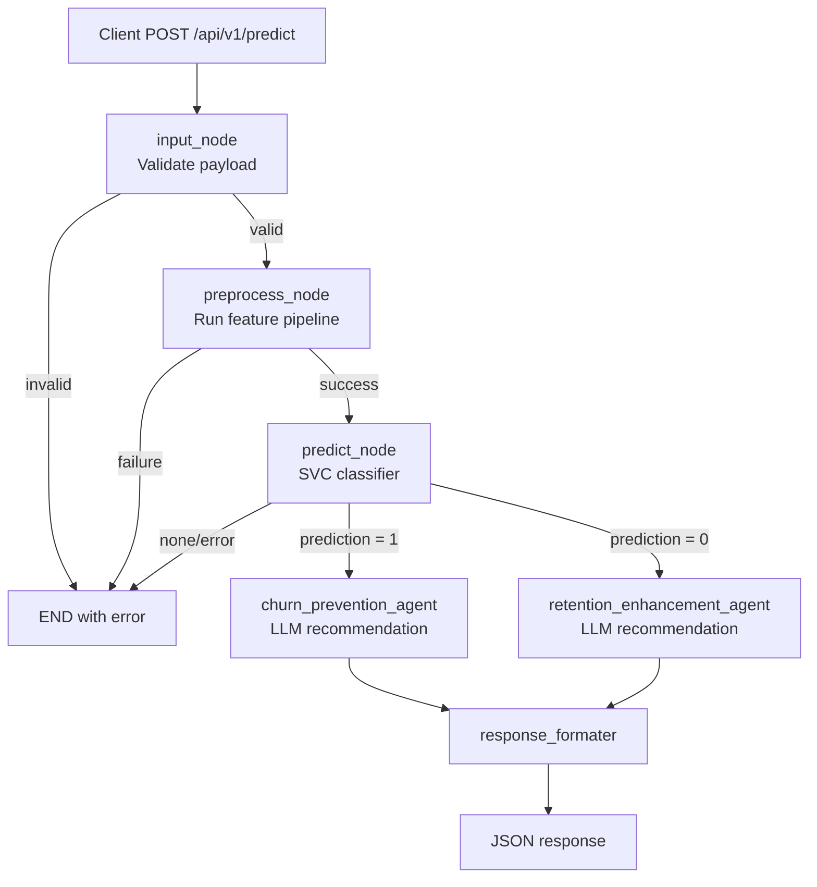

# Customer Churn Prediction Assistant API 📉🤖

An AI-powered API that predicts customer churn risk and generates actionable retention recommendations.

This project combines:
- A supervised machine learning classifier (SVC pipeline) for churn probability estimation.
- A LangGraph-based decision flow to orchestrate validation, preprocessing, prediction, and recommendation generation.
- A Gemini-based LLM for personalized churn prevention or loyalty enhancement strategies.
- A FastAPI interface for production-friendly HTTP access.

## 1. Project Description 🧭

The system receives structured customer profile data, validates it, preprocesses it using the same transformations used during model training, computes churn probability, and then routes the result to one of two recommendation agents:
- Churn prevention agent (for high-risk customers).
- Retention enhancement agent (for low-risk/loyal customers).

The final API response contains:
- `churn_risk` (boolean)
- `churn_probability` (float)
- `recommendation` (string)
- `error` (string or null)

### Core Workflow



### Main Components

- API layer: FastAPI app and route definition.
- Service layer: Builds initial agent state and invokes graph.
- Agent graph layer: LangGraph state machine with conditional routing.
- Model layer: Loads SVC pipeline and Gemini chat model.
- Config layer: Environment-based settings and optional Opik tracing.

## 2. Project Structure 🗂️

```text
customer-curn-prediction-asistant-api/
|-- main.py                         # Local entrypoint (uvicorn)
|-- pyproject.toml                  # Project metadata and dependencies
|-- README.md
|-- Data/                           # Raw, cleaned, and model-ready datasets
|-- notebooks/
|   |-- eda/                        # Exploratory data analysis notebooks
|   `-- training/                   # Training experiments (SVC, SMOTE, etc.)
`-- src/
		|-- api/
		|   |-- main.py                 # FastAPI app factory + CORS + router mount
		|   `-- routes.py               # POST /predict schema and endpoint
		|-- app/
		|   |-- service.py              # Calls compiled LangGraph app
		|   |-- agent/
		|   |   |-- graph.py            # Graph construction and node routing
		|   |   |-- schema.py           # Shared agent state contract
		|   |   `-- nodes/
		|   |       |-- input_nodes.py       # Payload validation and normalization checks
		|   |       |-- preprocess_nodes.py   # Feature preprocessing pipeline
		|   |       |-- predict_nodes.py      # Classifier inference + branching
		|   |       |-- prevention_nodes.py   # LLM strategy for high churn risk
		|   |       |-- retention_nodes.py    # LLM strategy for loyal customers
		|   |       `-- response_nodes.py     # Final API response formatter
		|   |-- models/
		|   |   |-- svc_pipeline.pkl          # Trained end-to-end sklearn pipeline
		|   |   |-- svc_transformers.py       # Legacy transformer registration helpers
		|   |   |-- model.py                  # Gemini model client
		|   |   `-- model_metadata.json
		|   `-- prompt/
		|       `-- template.py          # System prompts for recommendation agents
		`-- config/
				|-- settings.py              # Pydantic settings from .env
				`-- tracing.py               # Opik tracer integration
```

## 3. How To Run (Dependencies to API Startup) 🚀

### Prerequisites ✅

- Python 3.12+
- A virtual environment tool (recommended)
- Gemini API key

### Step 1: Clone and Enter Project 📥

```bash
git clone <your-repository-url>
cd customer-curn-prediction-asistant-api
```

### Step 2: Create and Activate Virtual Environment 🐍

Windows (PowerShell):

```powershell
python -m venv .venv
.\.venv\Scripts\Activate.ps1
```

macOS/Linux:

```bash
python -m venv .venv
source .venv/bin/activate
```

### Step 3: Install Dependencies 📦

Using `pip`:

```bash
pip install -e .
```

Alternative (if you use `uv`):

```bash
uv sync
```

### Step 4: Configure Environment Variables ⚙️

Create a `.env` file in the project root.

```env
GEMINI_API_KEY=your_gemini_api_key
GEMINI_AGENT_LLM_MODEL=gemini-3.1-flash-lite-preview

OPIK_API_KEY=your_opik_api_key
OPIK_URL=https://www.comet.com/opik/api
OPIK_PROJECT_NAME=Curn-Agent

API_PREFIX=/api/v1
```

Notes:
- `OPIK_*` values are optional if tracing is not used in your environment.
- Keep `.env` out of version control.

### Step 5: Run the API ▶️

Option A (root entrypoint):

```bash
python main.py
```

Option B (direct uvicorn):

```bash
uvicorn src.api.main:app --host 0.0.0.0 --port 8000 --reload
```

### Step 6: Verify the Service 🔎

- Swagger UI: `http://localhost:8000/docs`
- OpenAPI schema: `http://localhost:8000/openapi.json`

## API Quick Example 🧪

### Endpoint

- Method: `POST`
- Path: `/api/v1/predict`

### Example Request

```json
{
	"SeniorCitizen": "0",
	"tenure": 24,
	"PhoneService": "Yes",
	"MultipleLines": "No",
	"InternetService": "Fiber optic",
	"OnlineSecurity": "No",
	"OnlineBackup": "Yes",
	"DeviceProtection": "Yes",
	"TechSupport": "No",
	"StreamingTV": "Yes",
	"StreamingMovies": "Yes",
	"Contract": "Month-to-month",
	"PaperlessBilling": "Yes",
	"PaymentMethod": "Electronic check",
	"MonthlyCharges": 89.5,
	"FamilyStatus": "Family"
}
```

### Example cURL

```bash
curl -X POST "http://localhost:8000/api/v1/predict" \
	-H "Content-Type: application/json" \
	-d '{
		"SeniorCitizen": "0",
		"tenure": 24,
		"PhoneService": "Yes",
		"MultipleLines": "No",
		"InternetService": "Fiber optic",
		"OnlineSecurity": "No",
		"OnlineBackup": "Yes",
		"DeviceProtection": "Yes",
		"TechSupport": "No",
		"StreamingTV": "Yes",
		"StreamingMovies": "Yes",
		"Contract": "Month-to-month",
		"PaperlessBilling": "Yes",
		"PaymentMethod": "Electronic check",
		"MonthlyCharges": 89.5,
		"FamilyStatus": "Family"
	}'
```

## Response Format 📤

```json
{
	"churn_risk": true,
	"churn_probability": 0.8241,
	"recommendation": "...generated strategy...",
	"error": null
}
```

## Configuration Notes 📝

- Input validation is strict and enforces required features and controlled categorical values.
- The preprocessing node reuses the trained pipeline transformations to avoid training-serving skew.
- Legacy notebook pickles are supported by registering transformer functions before loading `svc_pipeline.pkl`.
- If recommendation generation fails, the API still returns prediction outputs and a fallback error message.

## Observability 📊

- Tracing is integrated with Opik (when configured).
- If tracing setup fails, the app logs warnings and continues serving requests.

## Suggested Development Workflow 🛠️

1. Update notebooks in `notebooks/training` when retraining models.
2. Export/replace `svc_pipeline.pkl` in `src/app/models`.
3. Keep these in sync after model updates:
	 - API request schema
	 - Agent state/schema
	 - Input validation required fields
	 - Preprocess feature column order
4. Run API contract tests for `/api/v1/predict` before deployment.

